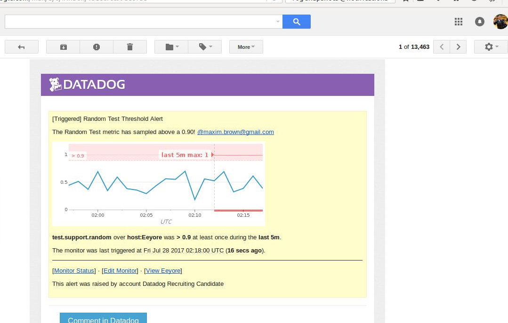

Your answers to the questions go here.
<h1>Level One</h1>
<h2>Bonus Question 1: In your own words, what is the Agent?</h2>

The Datadog Agent is code that is installed and runs on your hosts with the overall purpose of collecting, aggregating, and forwarding system data and metrics to Datadog. The Agent comprises a few components: First, the <b>collector</b> gathers general system metrics, such as memory and CPU, as well as information about any Datadog integrations that might be installed on the host. 

Second, it includes the <b>DogStatsD</b> service, an implementation of the StatsD protocol with a few Datadog-specific components added in, including the histogram metric type, support for service checks and events, and the ability to add tags. DogStatsD provides a set of libraries to aggregate and send custom application metrics. For more unique applications or systems that perhaps aren't covered by an integration, the AgentCheck interface allows for the creation of Agent Checks that can gather and send custom metrics and information. 

Finally, the <b>forwarder</b> combines all information gathered by the collector and DogStatsD and sends it on to Datadog.

  
<small>Host map details showing host tags, including "#exercise" and "#test."</small>

  
<h1>Level Two</h1>
<h2>Bonus Question 2: What is the difference between a timeboard and a screenboard?</h2>

  <b>TimeBoards</b> and <b>ScreenBoards</b> are two types of dashboards available to DataDog users. Both provide a way to easily see key metrics and data from your infrastructure in a single location, and both are easily customizable with a wide variety of data visualizations and reports.

On a TimeBoard, graphs are all anchored to the same time span and provide data as it is measured over that period. So, for example, one can view a host’s CPU usage and the number of times their database is accessed over the course the past hour. TimeBoards are a great way to compare metrics and try to find correlations between different events. Individual graphs can be shared with others.

ScreenBoards can include the same time-based metric graphs, but are more customizable and can include various other widgets that can provide a more complete picture of a monitored system. These range from basic note fields and images to a system event streamer to an iFrame that can display information from outside sources. Unlike TimeBoards, individual elements of a ScreenBoard cannot be shared alone; the full dashboard can be shared as read-only. This is great for displaying a live, high-level view of a system’s various components.

  
<small>Snapshot of test.support.random graph with annotation box and comment directed with @notification.</small>

  
<h1>Level Three</h1>
<small>Monitor alert set-up for test.support.random. Alert is set as a Multi Alert to trigger for all Hosts, current and future.</small>

  
<small>Success! The monitor was triggered and forwarded an alert to my email.</small>

  
<small>Set-up for the downtime for this alert to keep it quiet from 7:00pm to 9:00am so I can get some sleep.</small>

